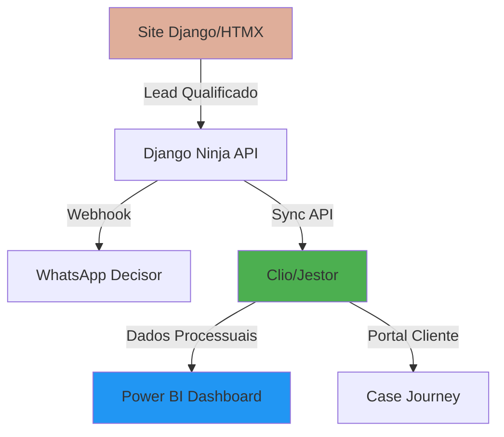

# Legal Ops Ecosystem Integration - Migration Plan

Migração estratégica do Django Admin para um ecossistema de **inteligência jurídica** integrado.

---

## Objetivo Estratégico

Transformar a plataforma em um **hub de Legal Ops** que conecta:
- ✅ **Site Premium** (Django/HTMX) - Captação e triagem de leads
- 🔄 **SaaS Legal** (Clio/Jestor) - Gestão de casos e operações
- 📊 **BI Dashboard** (Power BI) - Inteligência estratégica
- 📱 **WhatsApp** - Comunicação decisor

---

## Ativos Preservados (Não Migrar)

### 1. Frontend & Intake Bot
**Permanece em Django/HTMX** por performance e SEO:
- ✅ Robô de Triagem HTMX (footer)
- ✅ Lead Scoring especializado (Lipedema, Superendividamento)
- ✅ Identidade visual premium (Salmão #DFAE9A)
- ✅ Módulo In Brief (blog técnico)

### 2. API Layer
**Django Ninja permanece** como orquestrador:
- ✅ `/api/intake/` - Recepção de leads
- ✅ `/api/whatsapp/` - Webhook de notificações
- 🔄 **[NOVO]** `/api/sync/` - Sincronização com SaaS Legal

### 3. Dados Criptografados
**Mantém conformidade LGPD:**
- ✅ `EncryptedField` para CPF/CNPJ e telefones
- ✅ Modelo `Lead` com triage_data (JSON)
- ✅ Modelo `Client` (base para sincronização)

---

## Opções de Plataforma Legal Ops

### Opção 1: Clio (Recomendado para Maturidade)

**Vantagens:**
- Ecossistema completo: Clio Grow (CRM) + Clio Manage (Casos)
- 250+ integrações nativas
- Trust accounting (gestão de honorários)
- API REST robusta para sincronização

**Integração:**
```python
# apps/integrations/clio/client.py
class ClioClient:
    def create_matter(self, lead: Lead) -> str:
        """Cria caso no Clio a partir de lead qualificado."""
        response = requests.post(
            f"{CLIO_API_URL}/matters",
            headers={"Authorization": f"Bearer {CLIO_TOKEN}"},
            json={
                "data": {
                    "description": lead.get_case_type_display(),
                    "client": {"name": lead.full_name},
                    "custom_fields": lead.triage_data
                }
            }
        )
        return response.json()["data"]["id"]
```

**Custo:** ~$89/mês por usuário

---

### Opção 2: Jestor (Flexibilidade No-Code)

**Vantagens:**
- Customização total via interface visual
- Kanban para processos (Petição → Audiência → Sentença)
- Portal do cliente white-label
- Automações sem código

**Integração:**
```python
# apps/integrations/jestor/sync.py
class JestorSync:
    def sync_lead_to_record(self, lead: Lead):
        """Sincroniza lead como registro no Jestor."""
        jestor_api.create_record(
            table_id="leads",
            fields={
                "nome": lead.full_name,
                "tipo_caso": lead.case_type,
                "score": lead.score,
                "dados_triagem": json.dumps(lead.triage_data)
            }
        )
```

**Custo:** ~$49/mês (plano profissional)

---

### Opção 3: Smokeball (Produtividade)

**Vantagens:**
- AutoTime (rastreamento passivo de horas)
- Geração automática de documentos
- Integração com Outlook/Gmail

**Limitação:** Menos flexível para customização

---

## Arquitetura Proposta



---

## Implementação por Fases

### Phase 3A: API de Sincronização (1-2 dias)

#### [NEW] `apps/integrations/clio/`

**Estrutura:**
```
apps/integrations/
├── clio/
│   ├── client.py          # Cliente API Clio
│   ├── webhooks.py        # Receber updates do Clio
│   └── sync_service.py    # Lógica de sincronização
└── jestor/
    └── sync.py            # Alternativa Jestor
```

**Endpoint de Sincronização:**
```python
@router.post("/sync/lead-to-clio/")
def sync_lead_to_clio(request, lead_id: int):
    """Sincroniza lead qualificado para o Clio."""
    lead = Lead.objects.get(id=lead_id)
    
    if not lead.is_qualified:
        return {"error": "Lead não qualificado"}
    
    clio_client = ClioClient()
    matter_id = clio_client.create_matter(lead)
    
    # Salvar referência
    lead.external_id = matter_id
    lead.save()
    
    return {"clio_matter_id": matter_id}
```

---

### Phase 3B: Power BI Dashboard (2-3 dias)

#### KPIs Estratégicos

**Datasets a Exportar:**
1. **Leads por Origem** (Lipedema, Superendividamento, etc.)
2. **Taxa de Conversão** (Leads → Casos Aceitos)
3. **Lead-time Médio** por tipo de caso
4. **Receita Projetada** baseada em honorários médios

**Conexão:**
```python
# apps/analytics/export.py
def export_to_powerbi():
    """Exporta dados para Power BI via API."""
    leads = Lead.objects.filter(created_at__gte=timezone.now() - timedelta(days=30))
    
    dataset = {
        "rows": [
            {
                "case_type": lead.get_case_type_display(),
                "score": lead.score,
                "qualified": lead.is_qualified,
                "created_date": lead.created_at.isoformat()
            }
            for lead in leads
        ]
    }
    
    powerbi_api.push_dataset("leads_dashboard", dataset)
```

---

### Phase 3C: Case Journey (Portal do Cliente)

**Opção 1: Via Clio**
- Usar o **Clio Client Portal** nativo
- Customizar branding com cores do escritório

**Opção 2: Via Jestor**
- Criar portal white-label com timeline visual
- Integrar notificações por e-mail/WhatsApp

**Opção 3: Custom (Django)**
- Manter controle total da UX
- Usar HTMX para atualizações em tempo real

---

## Validação & Quality Gates

### 1. SonarQube MCP
```bash
# Análise estática antes de cada deploy
sonar-scanner \
  -Dsonar.projectKey=alessandra-legal-ops \
  -Dsonar.sources=src/apps/integrations \
  -Dsonar.host.url=http://localhost:9000
```

**Quality Gate:**
- ✅ 0 vulnerabilidades críticas
- ✅ 80%+ cobertura de testes
- ✅ Duplicação < 3%

### 2. Sentry MCP
```python
# Monitoramento de integrações
import sentry_sdk

sentry_sdk.init(
    dsn="YOUR_SENTRY_DSN",
    integrations=[DjangoIntegration()],
    traces_sample_rate=1.0,
)

# Capturar erros de API externa
try:
    clio_client.create_matter(lead)
except Exception as e:
    sentry_sdk.capture_exception(e)
```

### 3. UI Agent Testing
```python
# Teste E2E: Lead → Clio
def test_lead_to_clio_flow():
    # 1. Preencher bot de triagem
    # 2. Verificar lead criado
    # 3. Confirmar sincronização com Clio
    # 4. Validar matter_id retornado
```

---

## Roadmap de Migração

### Semana 1: Preparação
- [ ] Criar conta Clio/Jestor (trial)
- [ ] Obter credenciais de API
- [ ] Configurar ambiente de testes

### Semana 2: Integração Core
- [ ] Implementar `ClioClient`
- [ ] Endpoint `/api/sync/lead-to-clio/`
- [ ] Testes unitários de sincronização

### Semana 3: Automação
- [ ] Trigger automático: Lead qualificado → Clio
- [ ] Webhook reverso: Updates do Clio → Django
- [ ] Notificação WhatsApp com link do caso

### Semana 4: BI & Portal
- [ ] Configurar Power BI datasets
- [ ] Ativar Clio Client Portal
- [ ] Treinamento da Dra. Alessandra

---

## Custos Estimados

| Item | Custo Mensal | Observação |
|------|--------------|------------|
| Clio Grow + Manage | $89/usuário | Recomendado |
| Power BI Pro | $10/usuário | Dashboard |
| Twilio WhatsApp | ~$20 | 4000 msgs/mês |
| **Total** | **~$119/mês** | Escalável |

---

## Decisão Requerida

> [!IMPORTANT]
> **Qual plataforma Legal Ops você prefere?**
> 1. **Clio** - Maturidade e ecossistema completo
> 2. **Jestor** - Flexibilidade e customização
> 3. **Custom Django** - Controle total (mais trabalho)

Após a escolha, implemento a integração em 1-2 dias.
