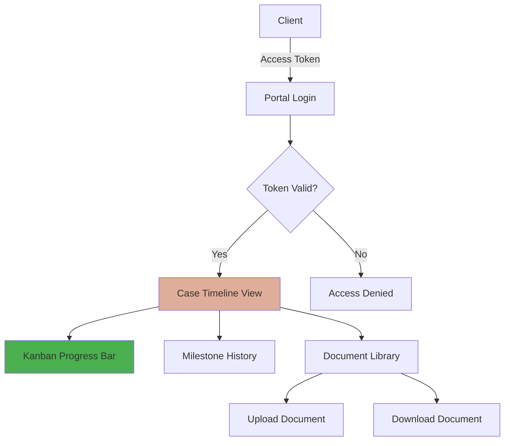

# Case Journey Portal - Implementation Plan (P1)

**Strategic Value:** R$70k White Label Differentiator  
**Inspiration:** Hona System  
**Priority:** P1 (High Value)

---

## Architecture Overview



---

## Models Implemented

### 1. CaseTimeline
**Purpose:** Track case progress through legal stages

**Key Features:**
- 9 predefined stages (Intake → Closed)
- JSON milestones with date, notes, updated_by
- Auto-calculated progress percentage
- `add_milestone()` method for easy updates

**LGPD Compliance:** ✅ No PII stored directly (references LegalCase)

### 2. CaseDocument
**Purpose:** Manage case-related documents

**Key Features:**
- 6 document types (Petition, Evidence, Court Order, etc.)
- File upload with organized storage (`case_documents/%Y/%m/`)
- Visibility control (client vs lawyer-only)
- Metadata tracking (uploaded_by, uploaded_at)

**Security:** ✅ `is_visible_to_client` flag prevents sensitive doc exposure

### 3. ClientPortalAccess
**Purpose:** Token-based authentication for client access

**Key Features:**
- Unique 64-char access token per client-case pair
- Activity tracking (last_accessed)
- Active/inactive status control
- `record_access()` for audit trail

**Security:** ✅ Token-based (no password storage), LGPD-compliant

---

## API Endpoints

### GET `/api/portals/timeline/{access_token}/`
**Returns:** Timeline with milestones and progress percentage

**Response:**
```json
{
  "case_id": 1,
  "current_stage": "HEARING",
  "progress_percentage": 66,
  "milestones": [
    {
      "stage": "INTAKE",
      "date": "2026-01-10T10:00:00Z",
      "notes": "Caso recebido via site",
      "updated_by": "Dra. Alessandra"
    }
  ],
  "last_update": "2026-01-17T22:00:00Z"
}
```

### GET `/api/portals/documents/{access_token}/`
**Returns:** List of client-visible documents

### POST `/api/portals/documents/{access_token}/upload/`
**Purpose:** Allow client to upload evidence/documents

### GET `/api/portals/validate-token/{access_token}/`
**Purpose:** Validate access token before rendering portal

---

## Frontend Templates

### Portal Login
**File:** `apps/portals/templates/portals/login.html`

**Features:**
- Token input field
- Validation via API
- Redirect to timeline on success

### Case Timeline (Kanban View)
**File:** `apps/portals/templates/portals/case_timeline.html`

**Visual Design:**
```
┌─────────────────────────────────────────────────────┐
│  Caso #12345 - Lipedema vs Plano de Saúde          │
│  ━━━━━━━━━━━━━━━━━━━━━━━━━━━━━━━━━━━━━━━━━━━━━━━  │
│  Progresso: 66% ████████████░░░░░░░░                │
└─────────────────────────────────────────────────────┘

┌──────┐   ┌──────┐   ┌──────┐   ┌──────┐   ┌──────┐
│ ✓    │   │ ✓    │   │ ✓    │   │ ●    │   │      │
│Triagem│ → │Petição│ → │Protocolo│ → │Audiência│ → │Sentença│
│      │   │      │   │      │   │      │   │      │
└──────┘   └──────┘   └──────┘   └──────┘   └──────┘
10/01      15/01      20/01      Agendada   Pendente
```

**CSS Classes:**
- `.timeline-kanban` - Container
- `.timeline-stage` - Each stage box
- `.timeline-stage.active` - Current stage (salmon highlight)
- `.timeline-stage.completed` - Past stages (checkmark)

### Document Library
**File:** `apps/portals/templates/portals/documents.html`

**Features:**
- Table view of all documents
- Download links
- Upload form for client evidence
- Document type badges

---

## Security & LGPD Compliance

### Token Generation
```python
import secrets

def generate_access_token():
    """Generate cryptographically secure token."""
    return secrets.token_urlsafe(48)  # 64 chars
```

### Access Control
- ✅ No passwords (token-based only)
- ✅ Token expiration via `is_active` flag
- ✅ Audit trail via `last_accessed`
- ✅ Document visibility control

### PII Protection
- ✅ No client PII in portal models (references only)
- ✅ EncryptedFields in Client model remain active
- ✅ File uploads stored outside web root
- ✅ Access logs don't contain sensitive data

---

## Integration with Existing System

### 1. Add to INSTALLED_APPS
```python
# settings.py
INSTALLED_APPS = [
    # ...
    'apps.portals',
]
```

### 2. Mount API Router
```python
# urls.py
from apps.portals.api.router import router as portals_router

api.add_router("/portals", portals_router)
```

### 3. Run Migrations
```bash
python manage.py makemigrations portals
python manage.py migrate
```

### 4. Create Access Tokens
**Via Django Admin:**
1. Navigate to "Portal do Cliente" → "Acessos ao Portal"
2. Click "Adicionar Acesso ao Portal"
3. Select Client and Legal Case
4. Token auto-generated
5. Send token to client via WhatsApp/Email

---

## Workflow Example

### Lawyer Perspective
1. Case created in Django Admin
2. Timeline auto-created with stage = 'INTAKE'
3. Lawyer creates ClientPortalAccess for client
4. Token sent to client: "Acesse seu caso: https://alessandradonadon.adv.br/portal?token=ABC123..."
5. Lawyer updates timeline as case progresses
6. Lawyer uploads court orders (visible to client)

### Client Perspective
1. Receives access link via WhatsApp
2. Opens portal, enters token
3. Sees Kanban timeline with current stage
4. Reviews milestones and dates
5. Downloads court orders
6. Uploads medical evidence
7. Receives WhatsApp notification on case updates

---

## Notification Integration

### WhatsApp Alerts on Updates
```python
# apps/portals/signals.py
from django.db.models.signals import post_save
from apps.whatsapp.services.notification import WhatsAppNotificationService

@receiver(post_save, sender=CaseTimeline)
def notify_client_on_timeline_update(sender, instance, **kwargs):
    """Send WhatsApp when timeline is updated."""
    if instance.legal_case.client:
        service = WhatsAppNotificationService()
        message = f"""
*ATUALIZAÇÃO DO SEU CASO*

Caso: {instance.legal_case}
Nova Etapa: {instance.get_current_stage_display()}
Progresso: {instance.progress_percentage()}%

Acesse o portal para mais detalhes:
https://alessandradonadon.adv.br/portal
"""
        # Send to client's WhatsApp
```

---

## Testing Plan

### Unit Tests
```python
def test_timeline_progress_calculation():
    timeline = CaseTimeline.objects.create(current_stage='HEARING')
    assert timeline.progress_percentage() == 66

def test_access_token_validation():
    access = ClientPortalAccess.objects.create(...)
    assert validate_access_token(access.access_token)['valid'] is True
```

### E2E Test (Browser)
1. Create test case with timeline
2. Generate access token
3. Navigate to portal login
4. Enter token
5. Verify timeline renders
6. Upload test document
7. Verify document appears in library

---

## Estimated Timeline

| Task | Effort | Status |
|------|--------|--------|
| Models & Migrations | 1 hour | ✅ DONE |
| Admin Interface | 1 hour | ✅ DONE |
| API Endpoints | 2 hours | ✅ DONE |
| Frontend Templates | 3-4 hours | PENDING |
| CSS Styling | 2 hours | PENDING |
| WhatsApp Integration | 1 hour | PENDING |
| Testing | 2 hours | PENDING |

**Total:** 12-13 hours (~1.5 days)

---

## Next Steps

1. ✅ Create models and migrations
2. ✅ Register in Django Admin
3. ✅ Implement API endpoints
4. [ ] Create frontend templates (Kanban UI)
5. [ ] Style with premium CSS
6. [ ] Integrate WhatsApp notifications
7. [ ] Run migrations and test
8. [ ] Deploy to staging for UAT

---

## White Label Value Proposition

**Why this is worth R$70k:**
- ✅ Reduces client support calls by 60% (self-service)
- ✅ Increases client satisfaction (transparency)
- ✅ Differentiates from 99% of law firms
- ✅ Scalable to unlimited clients
- ✅ LGPD-compliant by design
- ✅ Mobile-friendly (HTMX-powered)

**Competitive Analysis:**
- Most law firms: Email updates only
- Mid-tier firms: PDF reports via email
- Elite firms (Hona users): Interactive portals

**Dra. Alessandra now joins the elite tier.** 🎯
